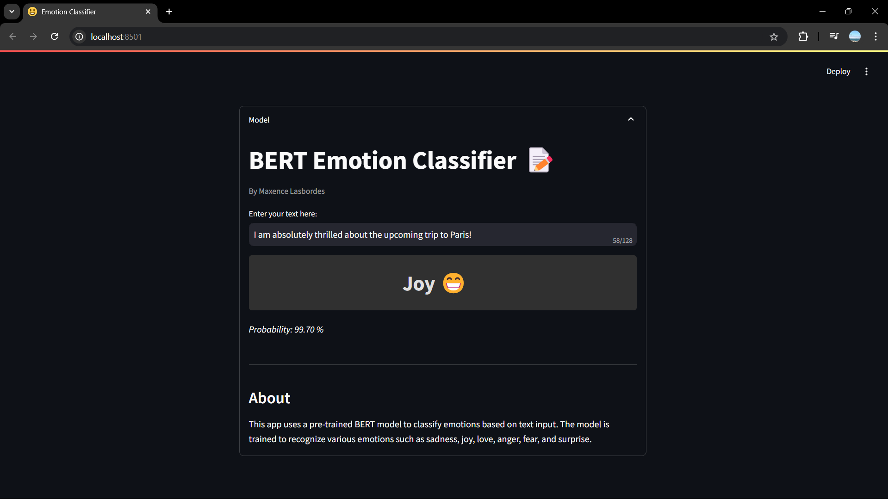

<div align="center">
  
</div>

# Introduction

I re-implemented BERT from scratch using the paper as a reference. I trained a custom tokenizer, cleaned and prepared a movie dialogue dataset, and built the pre-processing of the data for the NSP and MLM tasks. I also developed the input-embedding functions, the BERT model (transformer encoder + NSP + MLM), and the trainer, using PyTorch. Unfortunately, I wasn't able to train the model due to computational constraints. However, I successfully completed the model architecture and preprocessing pipeline, and validated the implementation with smaller-scale tests to ensure functionality.

To complete the process, I fine-tuned the pre-trained BERT model available on Hugging Face for emotion classification on a dataset of 30,000 posts, achieving 95% accuracy. I deployed this model using Streamlit.

_(Please check: notebook.ipynb)_

# Installation ✨

Use a dedicated environnement to install the librairies.

Clone repo :
```
git clone https://github.com/MaxLSB/BERT_LLM_From_Scratch.git
```
Install the requirements for the app:
```
pip install -r requirements.txt
```

# Streamlit local server 

<div align="center">
  
</div>

Download the weights of the emotion classifier model:
```
bash download_weights.sh
```
Launch the streamlit local server:
```
streamlit run app.py
```

_(Scripts must be executed from the root folder of the project, be careful about the paths!)_
