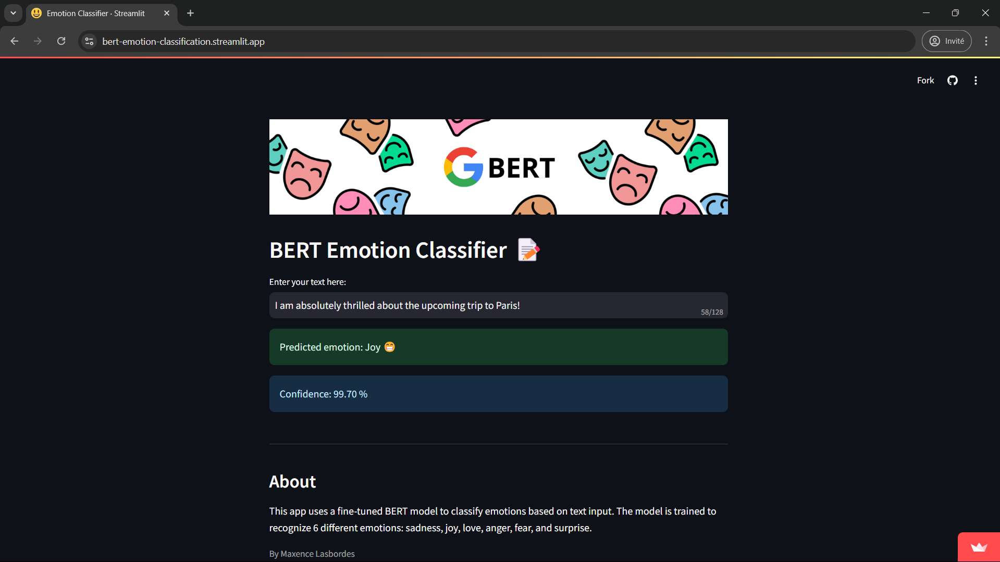

<div align="center">
  
</div>

# Introduction

I re-implemented BERT from scratch using the paper as a reference. I trained a custom tokenizer, cleaned and prepared a movie dialogue dataset, and built the pre-processing of the data for the NSP and MLM tasks. I also developed the input-embedding functions, the BERT model (transformer encoder + NSP + MLM), and the trainer, using PyTorch. Unfortunately, I wasn't able to train the model due to computational constraints. However, I successfully completed the model architecture and preprocessing pipeline, and validated the implementation with smaller-scale tests to ensure functionality.

To complete the process, I fine-tuned the pre-trained BERT model available on Hugging Face for emotion classification on a dataset of 30,000 english posts, achieving 95% accuracy. I deployed this model using Streamlit.

**You can access and test the model [here](https://bert-emotion-classification.streamlit.app/)**

_(Please also check: notebook.ipynb)_

# Project Structure

```
├── .gitattributes
├── app.py
├── BERT-Paper-Annotated.pdf
├── notebook.ipynb
├── README.md
├── requirements.txt
├── train_bert.py
├── train_tokenizer.py
├── tree.txt
├── assets
|    ├── banner.png
|    ├── streamlit-app.png
|    └── streamlit-banner.png
├── data
|    ├── movie_conversations.txt
|    ├── movie_lines.txt
|    ├── processed_data.json
|    └── twitter_emotions.csv
├── models
|    ├── bert.py
|    ├── classifier.py
|    ├── encoder.py
|    └── __init__.py
├── tokenizers
|    └── vocab.txt
├── trained_model
|    └── __init__.py
└── utils
     ├── data_download.py
     ├── data_loader.py
     ├── model_init.py
     ├── preProcessing.py
     ├── tokenizer_loader.py
     └── __init__.py
```

# Installation ✨

Use a dedicated environnement to install the librairies.

Clone repo :
```
git clone https://github.com/MaxLSB/BERT_LLM_From_Scratch.git
```
Install the requirements for the app:
```
pip install -r requirements.txt
```
You can pre-train this custom made BERT model from scratch (but the dataset used is very small, so the performance will not be good):
```
python train_bert.py
```
To train a new tokenizer from scratch using the dataset:
```
python train_tokenizer.py
```
BERT model for pre-training (NSP + MLM) and classifier for finetuning:
```
├── models
|    ├── bert.py
|    ├── classifier.py
|    ├── encoder.py
|    └── __init__.py
```
Dataset used as reference to build and pre-train the BERT model:
```
├── data
     ├── movie_conversations.txt
     ├── movie_lines.txt
     ├── processed_data.json
     └── twitter_emotions.csv
```

# Streamlit server

<div align="center">
  
</div>

You can access and test the model here:
```
https://bert-emotion-classification.streamlit.app/
```

